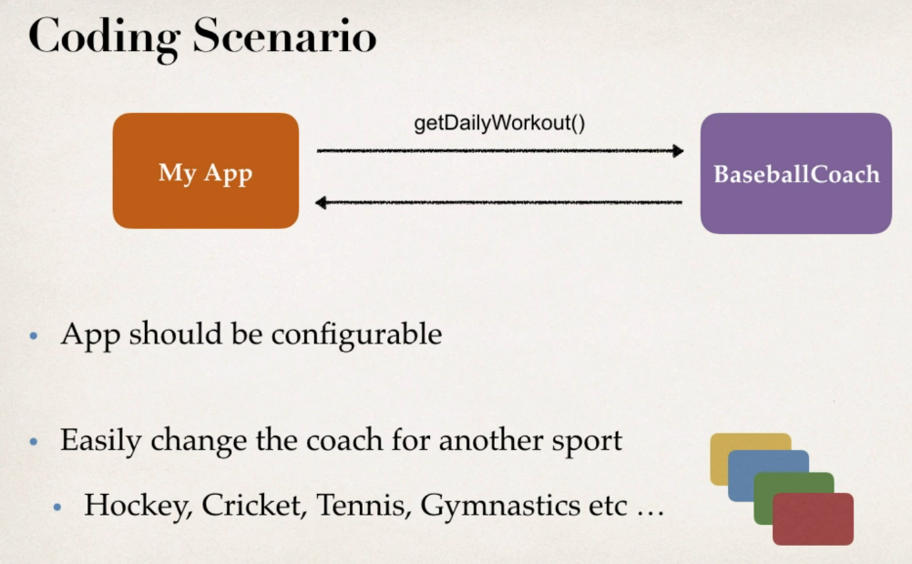
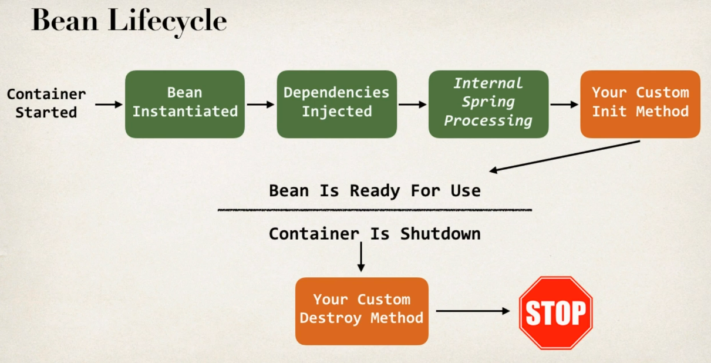

# Spring Notes
* [Spring framework jar files](https://repo.spring.io/ui/repos/tree/General/libs-release/org/springframework/spring/5.3.9/spring-5.3.9-dist.zip "https://repo.spring.io/ui/repos/tree/General/libs-release/org/springframework/spring/5.3.9/spring-5.3.9-dist.zip")
* Download this and copy the jar files to '/lib/' of project
* Or just use the spring initializer.

# Spring inversion of control
## What is inversion of control?
* The design process of outsourcing the construction and management of objects - outsourced to a object factory.
* This is essentially the factory design method.
* See '/home/phoenix/udemy/Spring/my-sols/sect-4/spring-demo-one' for implementation of the factory method. Figure below describes requirements of the application.



## Spring Container
* __Spring provides a built in object factory__ known as a 'spring container', therefore there is no need to define a factory method.
* Spring will generate the appropriate object type based on a config file.


### Primary functions of a spring container
* Create and manage objects(inversion of control).
* Inject objects dependencies(dependency injection).

### Configuring spring config
* XML config file (legacy, mostly legacy apps still use this)
* Java Annotations(modern)
* Java source code(modern)

# Spring Inversion of Control - XML config
## Spring development process
1) Configure your Spring beans:
* A "Spring bean" is simply a java object, that has been created by a spring container.

File: applicationsContext.xml  -> legacy
```
...
<beans ...>
    <bean id="BaseballCoach"
        class="com.examples.springdemo.BaseballCouch">
    </bean>
  </beans>
...
```
1) Create a spring container:
* Spring container is generically known as Application context.
* Specialized implementations:
  * ClassPathXmlApplicationContext
  * AnnotationConfigApplicationContext
  * GenericWebApplicationContext
  * others ...

Read in config file:
```
...
    ClassPathXmlApplicationContext context = new ClassPathXmlApplicationContext("applicationContext.xml");
...
```

3) Retrieve Beans from spring container:

```
...
//Retrieve bean from spring container
Coach theCoach = context.getBean("BaseballCoach", Coach.class);
...
```
* Note that `Coach.class` is the name of the interface that the `BaseballCoach` class implements.
* When we pass the interface to the method, behind the scenes Spring will cast the object for you.
* However, there are some slight differences than normal casting. Behaves the same as getBean(String), but provides a measure of type safety by throwing a BeanNotOfRequiredTypeException if the bean is not of the required type. This means that ClassCastException can't be thrown on casting the result correctly, as can happen with getBean(String).
* Note: see lecture 25 on how to add logging messages, will be useful for debugging!
  
# Spring Dependency Injection - XML config
* Allows the programmer to follow the dependency inversion principle.
* The client will delegate to external code(the injector), the responsibility of providing its dependencies.

"SOLID’s dependency inversion principle introduces interfaces between a higher-level class and its dependencies. That decouples the higher-level class from its dependencies so that you can change the code of a lower-level class without changing the code that uses it. The only code that uses a dependency directly is the one that instantiates an object of a specific class that implements the interface.

The dependency injection technique enables you to improve this even further. It provides a way to separate the creation of an object from its usage. By doing that, you can replace a dependency without changing any code and it also reduces the boilerplate code in your business logic." - from [dependency injection](https://stackify.com/dependency-injection/, "https://stackify.com/dependency-injection/")

* A Spring container will inject dependencies of an object when it is requested(Dependency injection).


## Injection types:
* There are many types in spring, the two most common are:
  * Constructor Injection
  * Setter Injection

### Constructor injection development process:
1) Define the dependency interface and class

FortuneService.java
```
    public interface FortuneService{
        public String getFortune();
    }
```

HappyFortuneService.java
```
public class HappyFortuneService implements FortuneService{
        @Override
    public String getFortune() {
        return "Today is your lucky day!";
    }
}
```
2) Create a constructor in your class for injections

BaseballCouch.java
```
...
public class BaseballCouch implements Couch{

    private FortuneService fortuneService;
    
    public BaseballCouch(FortuneService fortuneService) {
        this.fortuneService = fortuneService;
    }

    @Override
    public String getDailyWorkout(){
        return "Spend 30 mins on batting practice.";
    }

    public String getFortune(){
        return fortuneService.getFortune();
    }
}
...
```
3) Configure the dependency injection in the Spring config file

applicationContext.xml
```
...
    <bean id="happyFortuneService"
          class="com.example.springdemo.HappyFortuneService">
    </bean>
    <bean id="Baseball"
          class="com.example.springdemo.BaseballCouch">
        <constructor-arg ref="happyFortuneService"/>
    </bean>
...
```

* Note: Spring framework will essentially do this behind the scenes:
``` 
HappyFortuneService myFortuneService = new HappyFortuneService();
BaseballCoach myCoach = new BaseballCoach(myFortuneService);
```

### Setter injection development process:
* Setter injection injects dependencies by calling setter methods on your class.
1) Create setter methods in your class for injections

TrackCouch.java:
```
...
public class TrackCouch implements Couch{

    private FortuneService fortuneService;

    //Need to have no-arg constructor for when spring instantiates this bean
    public TrackCouch() {
    }

    public void setFortuneService(FortuneService fortuneService) {
        this.fortuneService = fortuneService;
    }

    @Override
    public String getDailyWorkout() {
        return "Run a 5k!";
    }

    @Override
    public String getFortune() {
        return fortuneService.getFortune();
    }
}
...
```
2) Configure the dependency injection in Spring config file

applicationContext.xml:
```
...
    <bean id="myFortuneService"
          class="com.example.springdemo.HappyFortuneService">
    </bean>
    <bean id="Track"
          class="com.example.springdemo.TrackCouch">
        <property name="fortuneService" ref="myFortuneService"/>
    </bean>
...
```
* Spring will attempt to call the method with the given property name prepended with 'set'. 

* Spring framework will essentially do this behind the scenes:
``` 
HappyFortuneService myFortuneService = new HappyFortuneService();
BaseballCoach myCoach = new BaseballCoach();
myCoach.setFortuneService(myFortuneService);
```

## Injecting literal values
* Also possible to inject literal values specified in the xml file or values specified in a properties file.
### Development process(values from xml file)
1) Create setter methods in your class for injections

TrackCouch.java:
```
...
public class TrackCouch implements Couch{

    ...
    private String email;
    private String teamName;
    ...

    public TrackCouch() {
    }

    ...
    public void setEmail(String email) {
        this.email = email;
    }

    public void setTeamName(String teamName) {
        this.teamName = teamName;
    }
    ...
}
...
```
2) Configure the dependency injection in Spring config file

applicationContext.xml:
```
...
    <bean id="myFortuneService"
          class="com.example.springdemo.HappyFortuneService">
    </bean>
    <bean id="Track"
          class="com.example.springdemo.TrackCouch">
        <property name="fortuneService" ref="myFortuneService"/>
        <property name="email" value="sunrise@gmail.com"/>
        <property name="teamName" value="sunrise"/>
    </bean>
...
```
### Development process(values from properties file)
1) Create Properties File

sport.properties.txt:
```
    foo.email=sunrise@gmail.com
    foo.name=sunrise
```
2) Load properties file in spring config file and reference them

applicationContext.xml:
```
...
    <context:property-placeholder location="classpath:sport.properties"/>

    <bean id="myFortuneService"
          class="com.example.springdemo.HappyFortuneService">
    </bean>

    <bean id="Track"
          class="com.example.springdemo.TrackCouch">
        <property name="fortuneService" ref="myFortuneService"/>
        <property name="email" value="${foo.email}"/>
        <property name="teamName" value="${foo.name}"/>
    </bean>
...
```

# Spring Inversion of Control - Java Annotations
### Java Annotations:
* A label/marker that provides certain 'meta-data'
* Can be processed at compile time or run-time for special processing.
* e.g. the `@Override` annotation, tells java to check if method signature and return type matches base class.

### Spring config with Annotations
* XML configuration can be verbose
* Spring beans can be configured with annotations which minimizes the XML config
* Spring will scan your java classes for special annotations and automatically register the beans in the spring container.

## Development Process
1) Enable component scanning in Spring config file
* Must specify the base package spring should scan through

applicationContext.xml:
```
...
<beans ...>
    <context:component-scan base-package="com.example.springdemo"/>
</beans>
...
```
2) Add the @Component Annotation to your Java classes

javaClass.java:
```
...
@Component("trackCoach")
public class TrackCoach implements Coach{
    @Override
    public String getWorkout(){
        return "Run 5k";
    }
}
...
```
* Where "trackCoach" is the bean id.
* Note that if you don't specify the bean id, it will be assigned the name of the class with a lower case first letter.
* However, for the special case of when BOTH the first and second characters of the class name are upper case, then the name is NOT converted.
  
3) Retrieve bean from Spring container.

```
ClassPathXmlApplicationContext appContext = new ClassPathXmlApplicationContext("applicationContext.xml");
Coach theCoach = context.getBean("trackCoach", Coach.class);
```

# Spring Dependency Injection - Java Annotations
## Spring AutoWiring
* AutoWiring - Spring will scan @Component classes and automatically inject any missing dependencies.
* Spring will search for properties that contain the `@Autowired` annotation
* Spring will then look for a class that matches the property (which contains the `autowired` annotation) type.
*  Spring will then instantiate that class and inject the bean.
*  If the dependency has an interface type, Spring will search for a class that implements that interface and inject it.

## AutoWiring Injection Types
### Constructor Injection
Development process:
1) Define the dependency interface and class

FortuneService.java
```
public interface FortuneService {
    public String getFortune();
}

```
HappyFortuneService.java
```
...
@Component
public class HappyFortuneService implements FortuneService{
    @Override
    public String getFortune() {
        return "Your going to learn something valuable today";
    }
}
```
2) Create a constructor in your class for injections & Configure the dependency injection with `@Autowired` annotation.

VolleyballCoach.java
```
@Component("Volleyball")
public class VolleyballCoach implements Coach {

    private FortuneService fortuneService;

    @Autowired
    public VolleyballCoach(FortuneService fortuneService) {
        this.fortuneService = fortuneService;
    }
    ...
}
```
* As of Spring Framework 4.3, an @Autowired annotation on such a constructor is no longer necessary if the target bean only defines one constructor to begin with. However, if several constructors are available, at least one must be annotated to teach the container which one to use.
* __Rather be explicit and use the annotation__

### Setter Injection
* Simply create setter method(s) in your class for injections & Configure the dependency injection with @Autowired annotation.

SwimmingCoach.java
```
@Component
public class SwimmingCoach implements Coach{

    private FortuneService fortuneService;

    public SwimmingCoach() {
    }
    
    @Autowired
    public void setFortuneService(FortuneService fortuneService){
        this.fortuneService = fortuneService;
    }
    ...
```
* Note that you can inject dependencies into __any__ method not just setter methods. BUt you can then __not__ cal these methods, so is essentially a setter method anyway. 
e.g.:
```
    //This is not a setter method
    @Autowired
    public void doSomething(FortuneService fortuneService){
        this.fortuneService = fortuneService;
    }
```

### Field Injection
* Can inject dependencies directly into field values, even private fields.
* Accomplished by using java reflection.
* Simply place the `@Autowired` annotation directly on the field, no need for setter methods.

RunningCoach.java
```
...
@Component
public class TrackCoach implements Coach{

    @Autowired
    private FortuneService fortuneService;

    public TrackCoach() {
    }
    ...
```

## Qualifiers for dependency injection
* A problem arises using the `@Autowired` annotation when there are multiple classes that implement the target dependency interface. 
* Will receive a 'NoUniqueBeanDefinitionException'.
* Solution: Use the `@Qualifier` annotation on the dependency itself, and .

e.g.
```
@Component
public class TrackCoach implements Coach{

    @Autowired
    @Qualifier("randomFortuneService")
    private FortuneService fortuneService;

    public TrackCoach() {
    }
```
* Syntax is different when using Constructor dependency injection. Must place Qualifier inside constructor on the dependency itself.

e.g.
```
    @Autowired
    public VolleyballCoach(@Qualifier("randomFortuneService")FortuneService fortuneService) {
        this.fortuneService = fortuneService;
    }
```

## Injecting literal values (from properties file)
Development process:
1) Create a properties file to hold your properties. It will be a name value pair. 

sport.properties:
```
    foo.email=myeasycoach@luv2code.com
    foo.team=Silly Java Coders
```

2) Load the properties file in the XML config file.

applicationContext.xml:
```
<context:property-placeholder location="classpath:sport.properties"/> 
```

3) Inject the properties values into your Swim Coach: SwimCoach.java

```
...
    @Value("${foo.email}")
    private String email;
        
    @Value("${foo.team}")
    private String team;
...
```

# Spring Bean Scopes and Lifecycle
## Scope
* Default scope of a bean is Singleton.
  * Spring container creates only one instance of the bean
  * It is cached in memory
  * All requests for the bean will return a __shared__ reference to the same bean.
* Defined keywords for scope in spring include:
  


### XML config:

* Can explicitly specify the state by making use of the `scope` attribute

applicationContext.xml:
```
...
<bean id="myCoach"
    class="com.example.springdemo.TrackCouch"
    scope="singleton">
</bean>
...
```

### Java Annotations config:
* Can explicitly specify the bean scope using annotations
* Simply specify the scope using the `@Scope()` annotation

```
@Component
@Scope("singleton")
public class VolleyballCoach implements Coach{
    ...
}
```

## Lifecycle 



## Bean Lifecycle Methods/Hooks
* You can add custom code during bean initialization
  * Calling custom business logic methods
  * Setting up handles to resources (db, socket, file etc)
* You can add custom code during bean destruction
  * Calling custom business logic methods
  *  Clean up handles to resources (db, socket, files etc)


### XML Config:
Development Process:
1) Define your methods for init and destroy within the bean class.
2) Configure the method names in Spring config file
   * For initialization method, simply specify the method using the `init-method` attribute.

applicationContext.xml
```
...
<bean id="myCoach"
    class="com.example.springdemo.TrackCouch"
    init-method="trackCoachInit">
</bean>
...
```
   * For destruction method, simply specify the method using the `destroy-method` attribute.

applicationContext.xml
```
...
<bean id="myCoach"
    class="com.example.springdemo.TrackCouch"
    destroy-method="trackCoachCleanup">
</bean>
...
```
* Note: __In contrast to the other scopes, Spring does not manage the complete lifecycle of a prototype bean__: the container instantiates, configures, and otherwise assembles a prototype object, and hands it to the client, with no further record of that prototype instance.
* Thus, although initialization lifecycle callback methods are called on all objects regardless of scope, __in the case of prototypes, configured destruction lifecycle callbacks are not called__. The client code must clean up prototype-scoped objects and release expensive resources that the prototype bean(s) are holding.
* See '/home/phoenix/udemy/Spring/spring-and-hibernate-for-beginners/01-spring-core-5/destroy-prototype-scope-bean-with-custom-processor-xml-config' for how to ensure prototype beans are destroyed.

### Java Annotation Config:
* Simply define your methods for init & destroy, then add annotations: `@PostConstruct` & `@PreDestroy`
* `@PostConstruct` method is called after the bean is constructed and dependencies have been injected.

```
    @PostConstruct
    public void init(){
        //init code here
    }

        @PreDestroy
    public void destroy(){
        //destroy code here
    }

```
* NB: If you are using Java 9 or higher, then you will encounter an error when using @PostConstruct and @PreDestroy in your code. When using Java 9 and higher, javax.annotation has been removed from its default classpath.
* To Resolve: 
  * Download the javax.annotation-api-1.3.2.jar from [link here](https://search.maven.org/remotecontent?filepath=javax/annotation/javax.annotation-api/1.3.2/javax.annotation-api-1.3.2.jar 'https://search.maven.org/remotecontent?filepath=javax/annotation/javax.annotation-api/1.3.2/javax.annotation-api-1.3.2.jar')
  * Open project structure, select modules and then dependencies.
  * Add the jar file to the project and 'tick' it.
  * Select okay.


## Special Note about Initialization and Destroy Method Signatures:
* Access modifier: The method can have any access modifier (public, protected, private)
* Return type: The method can have any return type. However, "void' is most commonly used. If you give a return type just note that you will not be able to capture the return value. As a result, "void" is commonly used.
* Method name: The method can have any method name.
* Arguments: The method can not accept any arguments. The method should be no-arg.


